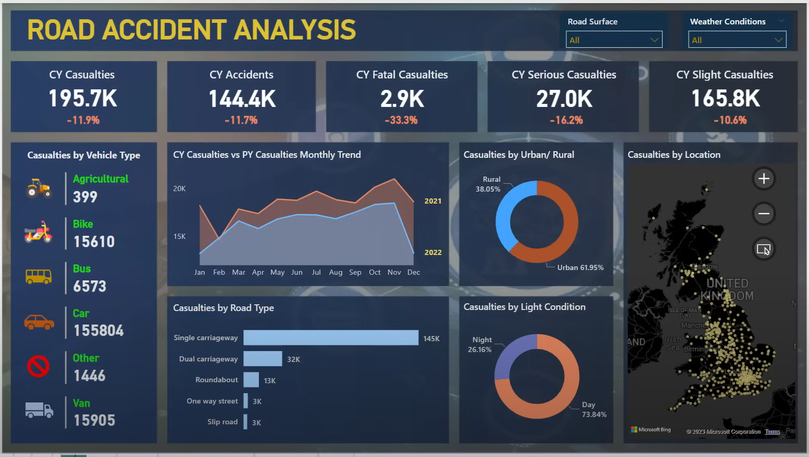

# Road Accident Analysis Dashboard
*Comprehensive data analysis and visualization of UK road accident casualties (2021-2022)*

---

## Project Overview
This project delivers a comprehensive analysis of road accident data for 2021-2022, designed to support evidence-based decision-making for road safety stakeholders. By examining casualty patterns across severity, vehicle type, location, and temporal factors, the analysis provides actionable insights to reduce accidents and improve public safety outcomes.  

---

## Analyst Contribution
I led the end-to-end execution of this project, including requirement gathering, data cleaning, KPI design, and Power BI dashboard development. My focus was on translating raw data into meaningful insights and presenting them through an interactive dashboard aligned with stakeholder needs.  

---

## Business Objectives

**Primary KPIs**
- Track total casualties and accidents with year-over-year growth analysis  
- Monitor casualty distribution by accident severity with comparative trending  
- Analyze vehicle type contribution to overall casualty figures  

**Secondary KPIs**
- Establish monthly casualty trends comparing current and previous year performance  
- Identify casualty patterns by road type, urban/rural classification, and day/night occurrence  
- Map geographic distribution of accidents and casualties by location  

---

## Methodology

### Data Processing & Quality Assurance
- **Data Source:** UK road accident dataset covering 2021-2022  
- **Tools Used:** Power BI for visualization, PowerPoint for dashboard design, Excel for data validation  
- **Data Cleaning:** Systematic validation, outlier detection, and missing value treatment  
- **Quality Controls:** Data integrity checks and standardization of categorical variables  

### Analytical Framework
1. Requirement gathering with stakeholders to define KPIs  
2. Exploratory data analysis across all variables  
3. Time series analysis for temporal patterns  
4. Year-over-year comparative analysis  
5. Geographic analysis of high-risk areas  
6. Data modeling for optimized dashboard functionality  

---

## Key Insights

### Overall Performance Trends
- **Total Casualties (CY):** 195.7K (↓11.9% YoY)  
- **Total Accidents (CY):** 144.4K (↓11.7% YoY)  
- **Severity Breakdown**  
  - Fatal casualties: 2.9K (↓33.3% YoY)  
  - Serious casualties: 27.0K (↓16.2% YoY)  
  - Slight casualties: 165.8K (↓10.6% YoY)  

### Vehicle Category Risk Analysis
- Cars: 155,804 casualties (major contributor)  
- Vans: 15,905 casualties  
- Motorcycles (Bikes): 15,610 casualties  
- Buses: 6,573 casualties  
- Agricultural Vehicles: 399 casualties  
- Other Vehicles: 1,446 casualties  

### Temporal and Geographic Patterns
- **Monthly Trend:** 2021 recorded higher peaks (notably in autumn) compared to 2022. A visible decline is observed toward the end of 2022.  
- **Day vs Night:** 73.84% of casualties occurred during the day, while 26.16% occurred at night.  
- **Urban vs Rural:** Urban areas accounted for 61.95% of casualties, while rural areas accounted for 38.05%.  
- **Road Type:**  
  - Single carriageways: 145K casualties  
  - Dual carriageways: 32K casualties  
  - Roundabouts: 13K casualties  
  - One-way streets: 3K casualties  
  - Slip roads: 3K casualties  

---

## Strategic Recommendations

### Immediate Action Items
- Strengthen safety infrastructure in **urban areas**, where ~62% of casualties occur.  
- Focus on **daytime driving risks**, which account for nearly three-quarters of incidents.  
- Develop targeted interventions for **car and motorcycle users**, the largest contributing categories.  

### Medium-Term Initiatives
- Conduct safety audits of **single carriageway roads**, which account for the majority of casualties.  
- Implement localized safety measures in high-density regions identified on the geographic heatmap.  
- Monitor seasonal trends to sustain reductions observed at year-end.  

### Long-Term Policy Development
- Develop specialized safety standards for **agricultural and commercial vehicles**.  
- Establish an integrated road safety framework involving multiple stakeholders.  

---

## Business Impact
The analysis reveals measurable progress in road safety, with double-digit declines across all severity categories and a 33.3% reduction in fatal casualties year-over-year. The findings highlight critical focus areas, including urban zones, daytime driving conditions, and single carriageway roads.  

These insights support evidence-based policymaking and efficient resource allocation, contributing to sustainable improvements in road safety.  

---

## Dashboard Features
The interactive Power BI dashboard enables stakeholders to:  
- Track KPIs and monitor performance against safety targets  
- Drill down by region, vehicle type, or severity  
- Compare year-over-year trends dynamically  
- Visualize casualties by geography with map integration  

---

## Technical Implementation
- **Visualization Tools:** Power BI with custom DAX calculations  
- **Data Architecture:** Star schema modeling for optimized queries  
- **Update Frequency:** Monthly refresh with automated validation  
- **Accessibility:** Mobile-responsive design for use by field teams  

---

#### Conclusion 
This project demonstrates applied skills in data cleaning, visualization, dashboard design, and business storytelling. It showcases my ability to transform raw data into actionable insights that inform real-world public safety strategies.  
